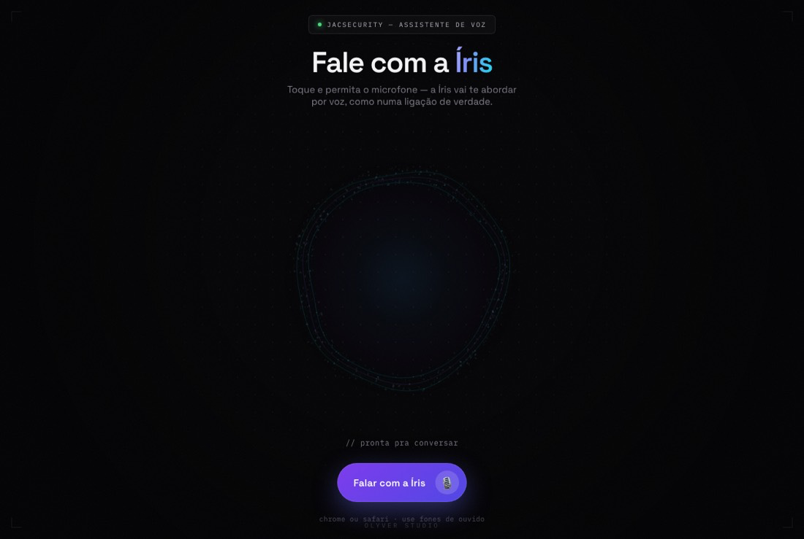

# Fale com a Íris — Demonstração de Voz

Demonstração pública do agente de voz da **Íris**, assistente de IA construída pela Olyver Studio. O visitante toca no botão, libera o microfone e **conversa por voz**, como numa ligação.

**[▶ Falar com a Íris](https://olyverstudio.github.io/iris-demo-voz/)**



## Por que existe

Descrever um agente de voz não vende agente de voz. A diferença entre "temos uma IA que atende por telefone" e a pessoa **ouvir a Íris falar** é a diferença entre uma promessa e uma prova.

Esta página é a prova, e leva menos de dez segundos para ser experimentada.

## O que tem

- **Captura de microfone** direto no navegador, sem instalar nada
- **Visualização reativa** que responde ao áudio, para que o usuário perceba que está sendo ouvido
- **Interface em tema escuro**, construída para a demonstração ter presença
- Aviso de compatibilidade — Chrome ou Safari, com fones de ouvido

## Relacionado

- [iris-jacsecurity](https://github.com/OlyverStudio/iris-jacsecurity) — o agente em si: Node.js, WhatsApp, prompts e deploy *(privado)*
- [agente-ia-whatsapp](https://github.com/GuilhermeOliveira337/agente-ia-whatsapp) — **versão pública e anonimizada** do agente, com o código aberto *(público)*

## Rodando localmente

```bash
git clone https://github.com/OlyverStudio/iris-demo-voz.git
cd iris-demo-voz
```

Abra o `index.html` no navegador. Precisa de HTTPS ou `localhost` para o microfone funcionar.

---

**Olyver Studio** · [olyverwebstudio.com.br](https://olyverwebstudio.com.br)
